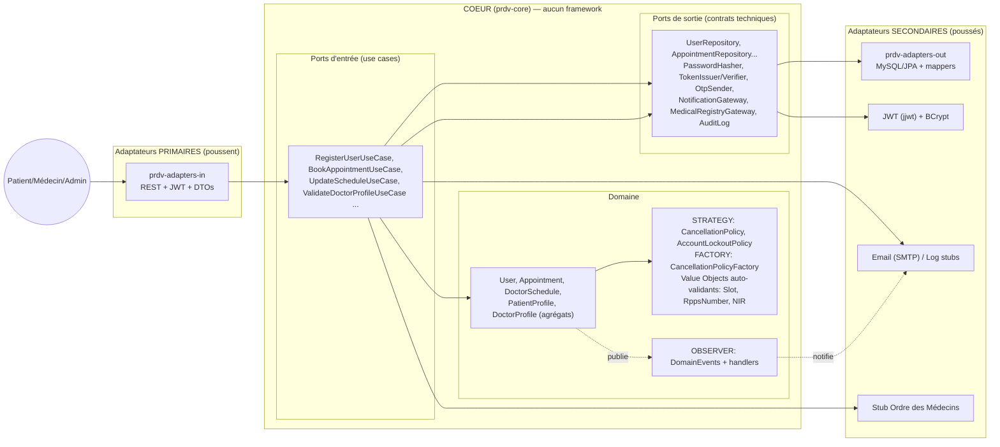

# PRDV — Backend de prise de rendez-vous médicaux

Backend **Spring Boot 3.3 / Java 21 / MySQL 8 / Docker**, en **architecture hexagonale (Ports & Adapters)**, avec un **cœur métier 100 % pur** (zéro dépendance Spring/Hibernate vérifiée par Maven) et les principes **SOLID** appliqués là où ils ont un effet concret, pas décoratif.

Ce dépôt implémente le **noyau transactionnel** de votre cahier des charges — les modules sans lesquels la plateforme n'existe pas — et laisse des **points d'extension branchables** (ports) pour les autres.

| Module du cahier des charges | État |
|---|---|
| **M1 — Utilisateurs & Authentification** (inscription multi-profils, OTP, 2FA-lite, blocage anti-force-brute, JWT + refresh, RBAC) | ✅ Implémenté |
| **M2 — Profils** (patient complet avec NIR validé, praticien avec RPPS à clé de contrôle, workflow de vérification, multi-cabinets) | ✅ Implémenté |
| **M4 — Agenda & RDV** (plages hebdomadaires, grille de créneaux, exceptions/congés, réservation atomique anti double-booking, annulation avec pénalités paramétrables, report conditionnel, liste d'attente avec réattribution automatique) | ✅ Implémenté |
| **M5 — Notifications** (ports multi-canal, sélection de canal par criticité, audit trail) | ✅ Cœur + adaptateurs log/email |
| M3 recherche, M6 télémédécine (lien de salle simulé), M7 paiement (frais d'annulation facturables), M8 DME, M9–M18 | 🔜 Branchés par des ports/interfaces — voir [Roadmap](#6-roadmap–comment-greffer-les-autres-modules) |

---

## 1. L'architecture hexagonale, en une image



**La règle de fer**, imposée par Maven (pas par une convention) :

```
prdv-core           → dépend de : (rien) + JUnit (tests)
prdv-adapters-in    → dépend de : prdv-core + Spring Web/Security
prdv-adapters-out   → dépend de : prdv-core + JPA/JJWT/Mail
prdv-app            → dépend de : tout (câblage)
```

Le cœur **définit** les interfaces (`UserRepository`, `TokenIssuer`, `NotificationGateway`…) ; les adaptateurs **les implémentent**. Toutes les flèches de dépendance pointent vers le centre : c'est l'**inversion de dépendances**. Vérifiable avec `mvn dependency:tree` sur `prdv-core`.

## 2. Le principe SOLID, appliqué au concret

| Principe | Où le voir dans ce code |
|---|---|
| **S**RP | Un handler = un cas d'usage (`LoginHandler` ne fait PAS d'OTP ; `OtpIssuer` ne fait PAS de login ; `SlotGenerator` ne fait PAS de persistance). Le `UserController` ne fait que traduire HTTP → port. |
| **O**CP | Ajouter un canal de notification = un bean de plus sur le port `NotificationGateway`, sans toucher aux use cases. Ajouter un mode d'annulation = un enum + un `case` dans la `CancellationPolicyFactory`. Les événements : ajouter un consommateur = déclarer un `DomainEventHandler`, le booking n'est pas modifié. |
| **L**SP | `LoggingNotificationGateway` / `EmailNotificationGateway`, `LoggingOtpSender` / `EmailOtpSender` : tout adaptateur du port est substituable (config `prdv.integrations.transport=log\|mail`), y compris mock dans les tests. |
| **I**SP | Des ports par besoin, pas une grosse interface `AuthService` : `TokenIssuer` ≠ `TokenVerifier`, `BookAppointmentUseCase` ≠ `ManageAppointmentUseCase` ≠ `GetAppointmentsUseCase`. Le directory n'expose que `DoctorDirectoryUseCase.search`, même s'il partage le repository. |
| **D**IP | `prdv-core` compile sans Spring : les agrégats interrogent `PasswordHasher` (pas `BCryptPasswordEncoder`), publient via `DomainEventPublisher` (pas `ApplicationEventPublisher`). Tout le câblage est dans `prdv-app/CoreBeansConfig`. |

## 3. Catalogue des Design Patterns

1. **Ports & Adapters (hexagonal)** — l'ossature décrite ci-dessus.
2. **Strategy** — `CancellationPolicy` (FLEXIBLE / STANDARD_24H / STRICT_48H avec pénalités en centimes), `AccountLockoutPolicy` (N échecs → blocage temporisé).
3. **Observer** — `DomainEventPublisher` + `DomainEventHandler` : l'annulation publie `Cancelled` ; deux observateurs réagissent indépendamment : notifications et **réattribution automatique au premier de la liste d'attente**.
4. **Factory** — `CancellationPolicyFactory.forMode(...)`, fabriques statiques `User.register(...)`, `Appointment.request(...)`, `DoctorSchedule.create(...)`.
5. **Repository** — chaque agrégat a son port de collection (`AppointmentRepository`…) ; l'adaptateur JPA fait le mapping, le domaine ignore Hibernate.
6. **Adapter** — partout : JPA, JWT (jjwt), SMTP, stub annuaire Ordre, `SpringDomainEventPublisher` qui adapte les événements du domaine vers le bus Spring.
7. **Facade** — `NotificationService` masque la mise en forme FR + choix de canal + envoi derrière 5 méthodes métier.
8. **Value Objects auto-validants** — `RppsNumber` (clé de contrôle mod 97 officielle !), NIR français validé, `TimeRange`, `Slot` : un état invalide est *irreprésentable*.
9. **State machine portée par l'entité** — `Appointment.confirm()/cancelByPatient()/rescheduleTo()` gardent les invariants (pas de setter public, pas d'annulation rétroactive).
10. **DTO + Mapper (anti-corruption layer)** — les entités JPA et les agrégats ne sortent jamais du back ; ex. le NIR est **masqué** dans les réponses (`DtoMapper.maskSsn`).

## 4. Ce qui est protégé par le domaine (et pas seulement par l'API)

- **Double-booking impossible** : `SELECT … FOR UPDATE` sur la ligne agenda (`lockDoctorSchedule`) + relecture des chevauchements **dans la même transaction** que l'enregistrement et les événements.
- **Grille de créneaux** : un créneau réservé doit être exactement un nœud de la grille du praticien (`WeeklyAvailabilityRule.coversSlot`), respecter préavis/horizon/jours bloqués.
- **Annulation tardive** : pénalité calculée par la politique de l'agenda, **report bloqué** dans la fenêtre de 24/48 h, annulation impossible une fois le RDV entamé.
- **Comptes** : OTP obligatoire avant login, blocage automatique après 5 échecs (configurable), refresh token ≠ access token (type vérifié dans le JWT).
- **Praticien** : RPPS validé par sa clé de contrôle + lookup annuaire (stub) + validation manuelle admin obligatoire avant de recevoir des patients.
- **Autorisation fonctionnelle** : `rescheduleByPatient` vérifie que le demandeur EST le patient du RDV — même si un administrateur API appelle l'endpoint.

## 5. Démarrer

### Option A — tout Docker (MySQL réel + données de démo)
```bash
docker compose up --build          # API sur :8080, MySQL sur :3306
# comptes seedés : alice@prdv.local / Patient!2026demo
#                 dr.sophie@prdv.local / Medecin!2026demo (vérifié)
#                 dr.marc@prdv.local   / Medecin!2026demo (NON vérifié -> rejets de booking attendus !)
#                 admin@prdv.local / Admin!2026demo
./scripts/demo.sh                  # parcours complet commenté
```

### Option B — sans Docker (H2 en mémoire + seed)
```bash
mvn -pl prdv-app -am spring-boot:run -Dspring-boot.run.profiles=local
```

### Tester
```bash
mvn test        # tests pur-JUnit du coeur (aucun contexte Spring, aucune DB)
```

### Exemples d'appels
```http
POST /api/auth/register        {"email","phone","password","role":"PATIENT"}
POST /api/auth/verify-email    {"email","code"}          # OTP (lu dans les logs en mode log)
POST /api/auth/login           -> {accessToken, refreshToken}
POST /api/auth/refresh

GET  /api/doctors?specialty=denta&limit=10                # public, vérifiés uniquement
GET  /api/slots/doctors/2?from=2026-09-07&days=14          # public
POST /api/appointments         Authorization: Bearer …    # {doctorId,start,type}
POST /api/appointments/42/cancel    {"reason":"…"}         # -> {"cancellationFeeCents":1000} si < 24h
POST /api/waitlist             {"doctorId":2,"earliest":"2026-09-08","latest":"2026-09-20","urgent":false}

# Côté médecin (JWT rôle DOCTOR) :
POST /api/schedule/me/rules    {"day":"MONDAY","start":"09:00","end":"12:00","durationMinutes":20}
POST /api/schedule/me/blocks   {"date":"2026-12-24","reason":"Réveillon"}
PUT  /api/schedule/me/settings {"minNoticeHours":2,"maxHorizonDays":45,"cancellationMode":"STRICT_48H","requiresManualConfirmation":true}

# Côté admin (modération) :
POST /api/admin/doctors/3/approve
POST /api/admin/doctors/3/reject   {"reason":"Diplôme illisible"}
```

## 6. Roadmap — comment greffer les autres modules

Le squelette est pensé pour l'extension ; chaque module futur = 1 package de plus dans `prdv-core` + ses adaptateurs :

| Module | Point d'extension déjà en place |
|---|---|
| M6 Téléconsultation | URL de salle générée à la réservation (stub `joinUrl()`) ; brancher un vrai SFU (LiveKit/Jitsi) derrière un port `TeleconsultationGateway`. |
| M7 Paiement | Les frais d'annulation sont déjà **chiffrés en centimes** sur l'agrégat et retournés par l'API ; créer `payment/` avec `PaymentGateway`/`FseTeletransmission` ports + Stripe/Fattur. |
| M8 DME | `DmpEntry`/`Prescription` agrégats dans `dme/` ; réutiliser `AuditLog` (journalisation exhaustive), `PasswordHasher`, valeur `Slot` pour les rendez-vous de suivi. |
| M5 (suite) | Templates par type + WhatsApp/SMS : un adaptateur = un bean. L'`AuditLog` deviendra une table append-only / SIEM sans toucher au cœur. |
| M10 Analytics | Consommer les mêmes `DomainEvent`s via un handler `AnalyticsProjector` (CQRS lecture) sur une base de projection — zéro impact sur le chemin transactionnel. |
| M13 Conformité | Chiffrement au repos : port `FieldEncryptor` autour des adaptateurs JPA (colonnes sensibles), conservation/archivage : jobs sur événements. |
| M14 Intégrations | Le port `MedicalRegistryGateway` montre le modèle : stub → vrai client HTTP (annuaire.sante.fr, CPAM), même signature. |
| M15 Mobile | L'API est déjà stateless + JWT + DTO stables : rien à changer, juste `refresh` en boucle côté app. |
| M17 Spécialités | Les types d'actes durent via les règles d'agenda (durée par règle) ; un modèle de plan de soin par pathologie = stratégie de plus. |

## 7. Arborescence

```
prdv-backend/
├── prdv-core/                         ❤ le domaine — framework-free, testé sans Spring
│   └── com.prdv
│       ├── shared/                    Exceptions + bus d'événements (Observer)
│       ├── identity/                  module 1 : User (state machine), OTP, lockout, tokens
│       ├── profile/                   module 2 : PatientProfile, DoctorProfile (workflow RPPS)
│       ├── schedule/                  module 4 : DoctorSchedule, Slot, Appointment, politiques
│       └── notification/              module 5 : Notification, gateway port, service facade
├── prdv-adapters-in/                  🌐 REST, sécurité JWT, DTOs, mapping, ProblemDetail
├── prdv-adapters-out/                 💾 JPA/MySQL, jjwt, BCrypt, SMTP/log, stub annuaire
├── prdv-app/                          🔌 CoreBeansConfig (composition root), Flyway V1__init,
│                                      seed de démo, router d'événements Spring
├── docker-compose.yml · Dockerfile · scripts/demo.sh
```

### Choix techniques assumés (et leur justification)
- **Agrégats en lignes JSON** (règles d'agenda, lieux d'exercice, allergies) : un agrégat = une ligne ; les sous-objets ne s'indexent pas seuls. Les entités à forter (users, appointments) gardent des colonnes + index dédiés.
- **Transaction à la frontière REST** : le cœur n'a aucune annotation ; l'adaptateur primaire ouvre la transaction qui englobe verrou + écriture + événements (réattribution liste d'attente atomique avec l'annulation).
- **OTP hashé en base** et **JWT stateless** ; la rotation avec révocation (table `refresh_tokens`) est la première marche suivante, documentée dans `RefreshTokenHandler`.
- **Seed via les use cases** : les données de démo prouvent en continu que le câblage complet fonctionne (un seed SQL ne testerait pas le domaine).
